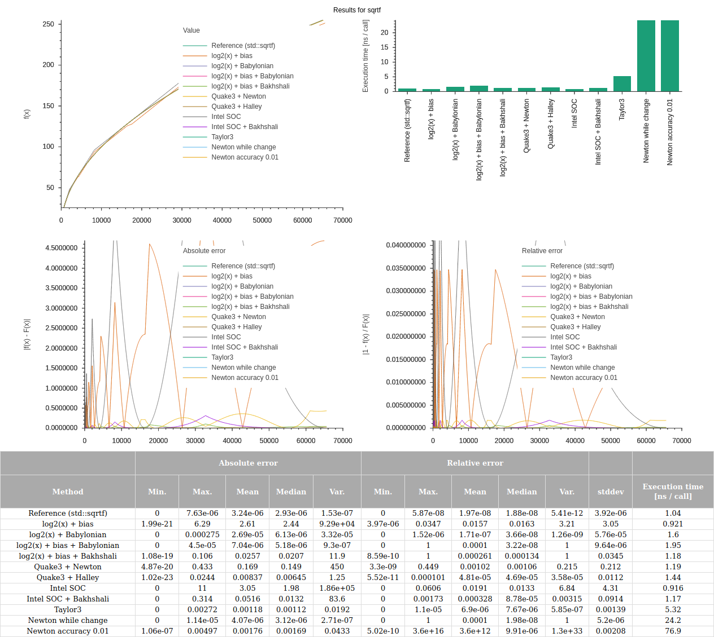

# C++ testbed for (transcendental) function approximations

Tests function approximations for speed and precision and can plot the results. The currently testable functions are:

* floating-point decadic logarithm (base 10)
* floating-point square root
* floating-point inverse square root
* integer square root

Note that **these are approximations only with varying degrees of precision and speed and all have their own strengths and weaknesses or may have certain range requirements**. I consciously left out tricks like using assembler code or SSE / NEON. These should be obvious and can be used in conjuction with some of the the methods here. Also a good compiler makes some of those optimizations for you anyway. Note that you should **compile with optimizations on** (```-O2 -ffast-math```), otherwise your results will be skewed!

Contributions like bug fixes, improvements or new approximation functions are welcome as pull requests.

## License

All my own work is under the [MIT License](LICENSE), but I am standing on the shoulders of giants:

* [cxxopts](https://github.com/jarro2783/cxxopts) ([MIT License](./cxxopts/LICENSE))
* [sciplot](https://github.com/sciplot/sciplot) ([MIT License](./sciplot/LICENSE))
* There's no licenses for most of the approximation functions, but I've tried at least attributing them or stating the source in the comments.

## Building

### Prequisites

* Clone repo with all submodules using ```git clone --recursive https://github.com/HorstBaerbel/approx``` or update all submodules after cloning using ```git submodule init && git submodule update```.
* Use a C++17-capable compiler.
* [GNUplot](http://gnuplot.sourceforge.net) 4.2 or higher installed if you want to plot results.

### From the command line

Navigate to the approx folder, then:

```sh
mkdir build && cd build
cmake ..
make -j$(nproc)
```

### From Visual Studio Code

* **Must**: Install the "C/C++ extension" by Microsoft.
* **Recommended**: If you want intellisense functionality install the "C++ intellisense" extension by austin.
* **Must**: Install the "CMake Tools" extension by Microsoft.
* You might need to restart / reload Visual Studio Code if you have installed extensions.
* Open the approx using "Open folder...".
* Choose a kit of your choice as your active CMake kit if asked, or let CMake decide on its own.
* You should be able to build now using F7 and build + run using F5.

## Usage

Run ```approx``` with the following options:

* ```-h``` or ```--help```: Show help.
* ```-f FUNC``` or ```--function FUNC```: Test function, where FUNC can be:
  * ```log10f```: Test approximations for the float log10 function.
  * ```invsqrtf```: Test approximations for the float 1 / square root function.
  * ```sqrtf```: Test approximations for the float square root function.
  * ```sqrti```: Test approximations for the 32-bit square root function.
* ```-p FORMAT``` or ```--plot FORMAT```: Plot results using [GNUplot](http://gnuplot.sourceforge.net) (must be installed) where FORMAT can be:
  * ```pdf```: Output result plots to result.pdf file.
  * ```html```: Output result table and plots to result.html file.

The result is a listing of every function tested, its min/max absolute and relative errors, the standard deviation and the execution time per call, e.g.

```console
Testing: sqrtf
Input range: (1.17549e-38, 65535), 10000 samples in range
Approximate loop and call overhead (already subtracted): 0.2728 ns / call
Tested functions:

#0 - Reference
Absolute error: (0, 7.62852e-06), mean: 3.24438e-06, median: 2.93015e-06, variance: 1.53489e-07
Relative error: (0, 5.87042e-08), mean: 1.96719e-08, median: 1.87608e-08, variance: 5.40974e-12
Standard deviation: 3.9181e-06
Execution time: 1.1701 ns / call

...

#2 - log2(x) + Babylonian
Absolute error: (0, 0.000275493), mean: 2.6902e-05, median: 6.12509e-06, variance: 3.31772e-05
Relative error: (0, 1.52183e-06), mean: 1.7114e-07, median: 3.65627e-08, variance: 1.26044e-09
Standard deviation: 5.76032e-05
Execution time: 1.6986 ns / call
```

Also a result.html or result.pdf file will be saved to the current directory if you specified "-p":  



## Todo

* Add more functions (1/x, sin / cos / tan / atan2 / etc.).
* Improve error and timing statistics plots.

## Random interesting links

* https://stackoverflow.com/questions/1427422/cheap-algorithm-to-find-measure-of-angle-between-vectors
* https://github.com/chmike/fpsqrt/blob/master/fpsqrt.c
